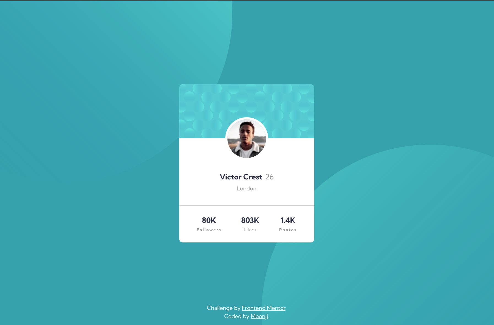
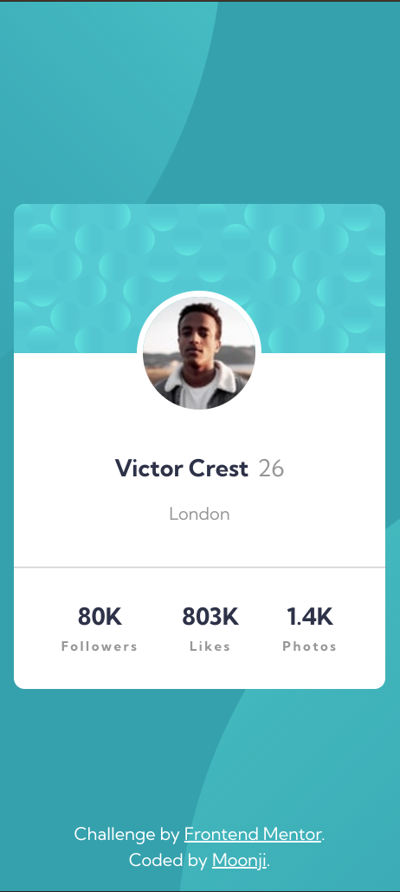

# Frontend Mentor - Profile card component solution

This is a solution to the [Profile card component challenge on Frontend Mentor](https://www.frontendmentor.io/challenges/profile-card-component-cfArpWshJ). Frontend Mentor challenges help you improve your coding skills by building realistic projects. 

## Table of contents

- [Overview](#overview)
  - [The challenge](#the-challenge)
  - [Screenshot](#screenshot)
  - [Links](#links)
- [My process](#my-process)
  - [Built with](#built-with)
  - [Continued development](#continued-development)
- [Author](#author)

## Overview

### The challenge

- Build out the project to the designs provided

### Screenshot

<ins>Frontend Mentor's Desktop Design</ins>

<ins>My Desktop Solution</ins>

<ins>Frontend Mentor's Mobile Design</ins>

<ins>My Mobile Solution</ins>

### Links

- Solution URL: [Github](https://github.com/moonji-spoonji/Profile-Card-Component)
- Live Site URL: [Netlify](https://profile-card-component-moonji.netlify.app/)

## My process

### Built with

- Semantic HTML5 markup
- CSS custom properties
- Flexbox
- CSS Grid

### Continued development

I want to work more with background design. I am not too familiar with how to incorporate images, or more specifically .svg files, with a background or simple positioning for more elegant designs. 

## Author

- Frontend Mentor - [@moonji-spoonji](https://www.frontendmentor.io/profile/moonji-spoonji)

